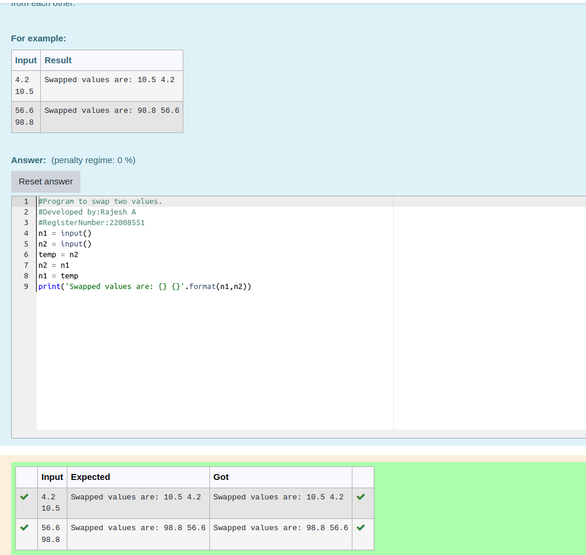

# Swapping-two-values
## AIM:
To write a python program for swapping of two values
## EQUIPEMENT'S REQUIRED: 
PC
Anaconda - Python 3.7
## ALGORITHM: 
### Step 1:import numpy as np
### Step 2:get the input matrix
### Step 3:find the swapp 
### Step 4:print the result
### Step 5: 
Print the values
### Step 6: 
End the program
## PROGRAM:
```
#Program to swap two values.
#Developed by:Rajesh A 
#RegisterNumber:22008551
n1 = input()
n2 = input()
temp = n2
n2 = n1
n1 = temp
print('Swapped values are: {} {}'.format(n1,n2))
```
## Output:



## RESULT:
Thus the swapping of two values are successfully executed


